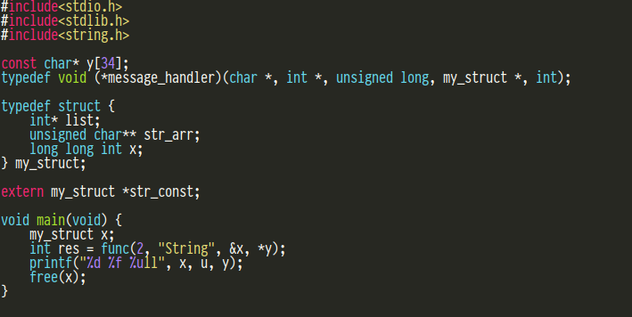
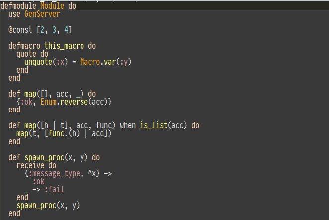
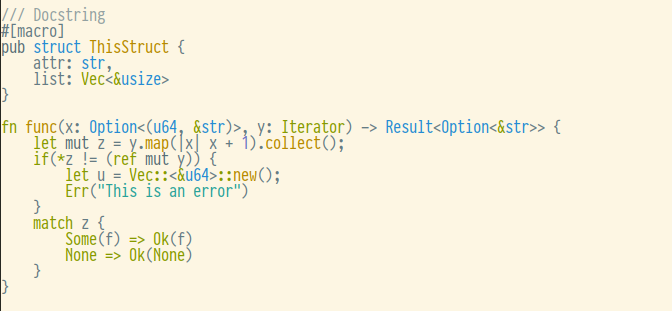

# pysyntect
[](https://raw.githubusercontent.com/spyder-ide/pysyntect/master/LICENSE)
[](https://pypi.org/project/pysyntect/)
[](https://www.anaconda.com/download/)
[](https://www.anaconda.com/download/)
[](https://pepy.tech/project/pysyntect)
[](https://github.com/spyder-ide/pysyntect)


*Copyright © 2020– Spyder Project Contributors*

## Overview
Python bindings for the [Syntect](https://github.com/trishume/syntect) library. Pysyntect provides a lightweight, fast engine to compute syntax highlighting using [Sublime Text syntax definitions](http://www.sublimetext.com/docs/3/syntax.html#include-syntax) and TextMate theme definitions, which are shared by many editors.

<!-- Insert some image here -->

<!--  -->
<!--  -->
<!--  -->

## Installing
To install pysyntect, you can use both conda or pip package managers:

```bash
# Using Conda (Recommended)
conda install pysyntect -c spyder-ide

# Using pip
pip install pysyntect
```


## Dependencies
To compile pysyntect, you will require the latest nightly release of [Rust](https://rustup.rs/), alongside [Cargo](https://crates.io/). Also, it requires a Python distribution with its corresponding development headers. Finally, this project depends on the following Cargo crates:

* [PyO3](https://github.com/PyO3/pyo3): Library used to produce Python bindings from Rust code.
* [Syntect](https://github.com/trishume/syntect): Syntax highlighting library in Rust.
* [Maturin](https://github.com/PyO3/maturin): Build system to build and publish Rust-based Python packages

## Compilling locally
Besides Rust, you will require the latest version of maturin installed to compile this project locally:

```bash
pip install maturin toml
```

After installing those packages, it is possible to execute the following command to compile pysyntect:

```bash
maturin develop
```

In order to produce wheels, ``maturin build`` can be used instead. This project supports [PEP517](https://www.python.org/dev/peps/pep-0517/), thus pip can be used to install this package as well:

```bash
pip install -U .
```

## Running tests
We use pytest to run tests as it follows (after calling ``maturin develop``):

```bash
pytest -v syntect/tests
```

## Package usage
Pysyntect provides utillities and functions for loading themes and syntax definitions, as well to highlight text strings. Pysyntect supports over 500 [syntax language definitions](https://github.com/spyder-ide/pysyntect/tree/master/syntect/grammars) across many TextMate theme definitions (not included as part of this package).

```python
from syntect import (highlight, load_theme_folder,
                     load_default_syntax, load_syntax_folder,
                     escape_to_console)

# Load default syntax grammars
syntax = load_default_syntax()

# Load syntax grammars from a path
syntax = load_syntax_folder("path/to/a/folder/with/grammars")

# Languages supported by the syntax set
syntax.languages

# Load theme definitions from a path
themes = load_theme_folder("path/to/a/folder/with/themes")

# List of themes loaded
themes.themes

# Select a theme
theme = themes['<name_of_the_theme>']

# Load a file and syntax highlight it
with open('my_file.extension', 'r') as f:
    lines = f.read()

# Returns a list of styles to apply per token
color_ranges = highlight(lines, 'extension', syntax, theme)

# Get background/foreground colors by token
style, token = color_ranges[0]

background = style.background
foreground = style.foreground

components = ('r', 'g', 'b', 'a')
bg_red, bg_green, bg_blue, bg_alpha = [getattr(background, c)
                                       for c in components]
fg_red, fg_green, fg_blue, fg_alpha = [getattr(foreground, c)
                                       for c in components]

# Preview syntax highlighing result to console
escape_to_console(color_ranges, display_bg=True)
```

## Changelog
Please see our [CHANGELOG](https://github.com/spyder-ide/pysyntect/blob/master/CHANGELOG.md) file to learn more about our new features and improvements.


## Contribution guidelines
We follow PEP8 and PEP257 for pure python packages and Rust to compile extensions. We use MyPy type annotations for all functions and classes declared on this package. Feel free to send a PR or create an issue if you have any problem/question.
